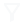
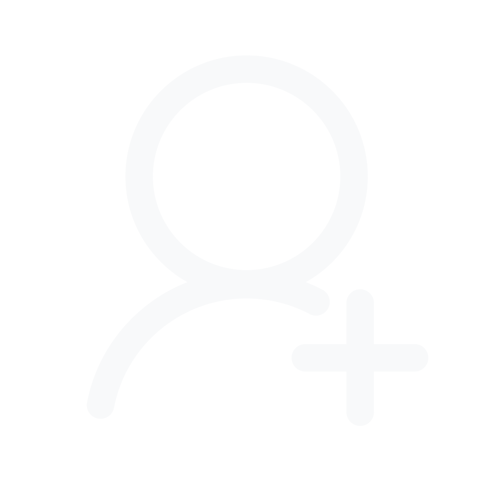

# [CodeCatch Icons](https://github.com/codecatchorg/codecatch-icons)

[![npm][npm-image]][npm-url]

[npm-image]: https://img.shields.io/npm/v/codecatch-icons.svg?style=flat-square
[npm-url]: https://www.npmjs.com/package/codecatch-icons

CodeCatch Icons is a React-based icon library intended for all CodeCatch React projects.

## Installation

```bash
yarn add codecatch-icons
# or
npm install codecatch-icons
```

example usage

```jsx
import { SunIcon } from "codecatch-icons";
const Component = () => {
  return (
    <h1>
      Don't stare directly at the <SunIcon />
    </h1>
  );
};
```

## Icons

|                                     AccountIcon                                      |                                   CheckIcon                                    |                                       ChecklistIcon                                        |                                          ChevronDownIcon                                          |                                          ChevronLeftIcon                                          |                                           ChevronRightIcon                                           |                                   CloseIcon                                    |                                       CopyCodeIcon                                       |                                       CopyLinkIcon                                       |
| :----------------------------------------------------------------------------------: | :----------------------------------------------------------------------------: | :----------------------------------------------------------------------------------------: | :-----------------------------------------------------------------------------------------------: | :-----------------------------------------------------------------------------------------------: | :--------------------------------------------------------------------------------------------------: | :----------------------------------------------------------------------------: | :--------------------------------------------------------------------------------------: | :--------------------------------------------------------------------------------------: |
| " height="24"> | " height="24"> | " height="24"> | " height="24"> | " height="24"> | " height="24"> | " height="24"> | " height="24"> | " height="24"> |

|                                    DeleteIcon                                     |                                  EditIcon                                   |                                 EyeIcon                                  |                                     EyeOffIcon                                     |                                      FacebookIcon                                       |                                           FacebookFillIcon                                           |                                    FilterIcon                                     |                                    GitHubIcon                                     |                                         GitHubFillIcon                                         |
| :-------------------------------------------------------------------------------: | :-------------------------------------------------------------------------: | :----------------------------------------------------------------------: | :--------------------------------------------------------------------------------: | :-------------------------------------------------------------------------------------: | :--------------------------------------------------------------------------------------------------: | :-------------------------------------------------------------------------------: | :-------------------------------------------------------------------------------: | :--------------------------------------------------------------------------------------------: |
| " height="24"> | " height="24"> | " height="24"> | " height="24"> | " height="24"> | " height="24"> | " height="24"> | " height="24"> | " height="24"> |

|                                     GoBackIcon                                     |                                    GoogleIcon                                     |                                         GoogleFillIcon                                         |                                  InfoIcon                                   |                                   LoginIcon                                    |                                    LogoutIcon                                     |                                  MenuIcon                                   |                                  MoonIcon                                   |                                  MoreIcon                                   |
| :--------------------------------------------------------------------------------: | :-------------------------------------------------------------------------------: | :--------------------------------------------------------------------------------------------: | :-------------------------------------------------------------------------: | :----------------------------------------------------------------------------: | :-------------------------------------------------------------------------------: | :-------------------------------------------------------------------------: | :-------------------------------------------------------------------------: | :-------------------------------------------------------------------------: |
| " height="24"> | " height="24"> | " height="24"> | " height="24"> | " height="24"> | " height="24"> | " height="24"> | " height="24"> | " height="24"> |

|                                     PaletteIcon                                      |                                     ProfileIcon                                      |                                       ReCaptchaIcon                                        |                                  SaveIcon                                   |                                    SearchIcon                                     |                                      SettingsIcon                                       |                                     SignUpIcon                                     |                                 SunIcon                                  |                                    UploadIcon                                     |
| :----------------------------------------------------------------------------------: | :----------------------------------------------------------------------------------: | :----------------------------------------------------------------------------------------: | :-------------------------------------------------------------------------: | :-------------------------------------------------------------------------------: | :-------------------------------------------------------------------------------------: | :--------------------------------------------------------------------------------: | :----------------------------------------------------------------------: | :-------------------------------------------------------------------------------: |
| " height="24"> | " height="24"> | " height="24"> | " height="24"> | " height="24"> | " height="24"> | " height="24"> | " height="24"> | " height="24"> |

## Contributing

1. Run `git clone https://github.com/codecatchorg/codecatch-icons.git`

2. Run `yarn` to install the dependencies

3. Create a new branch off master

4. Add the desired svg file to the `./raw` directory

5. Run `yarn build`

6. Run `git add .`

7. Commit your changes according to [semantic-release](https://github.com/semantic-release/semantic-release#how-does-it-work) requirements

8. Run `git push`
