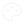
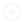
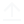

# [CodeCatch Icons](https://github.com/codecatchorg/codecatch-icons)

[![npm][npm-image]][npm-url]

[npm-image]: https://img.shields.io/npm/v/codecatch-icons.svg?style=flat-square
[npm-url]: https://www.npmjs.com/package/codecatch-icons

CodeCatch Icons is a React-based icon library intended for all CodeCatch React projects.

## Installation

```bash
yarn add codecatch-icons
# or
npm install codecatch-icons
```

example usage

```jsx
import { SunIcon } from "codecatch-icons";
const Component = () => {
  return (
    <h1>
      Don't stare directly at the <SunIcon />
    </h1>
  );
};
```

## Icons

" height="36">&nbsp;&nbsp;&nbsp;&nbsp;&nbsp;" height="36">&nbsp;&nbsp;&nbsp;&nbsp;&nbsp;" height="36">&nbsp;&nbsp;&nbsp;&nbsp;&nbsp;" height="36">&nbsp;&nbsp;&nbsp;&nbsp;&nbsp;" height="36">&nbsp;&nbsp;&nbsp;&nbsp;&nbsp;" height="36">&nbsp;&nbsp;&nbsp;&nbsp;&nbsp;" height="36">&nbsp;&nbsp;&nbsp;&nbsp;&nbsp;" height="36">&nbsp;&nbsp;&nbsp;&nbsp;&nbsp;" height="36">

" height="36">&nbsp;&nbsp;&nbsp;&nbsp;&nbsp;" height="36">&nbsp;&nbsp;&nbsp;&nbsp;&nbsp;" height="36">&nbsp;&nbsp;&nbsp;&nbsp;&nbsp;" height="36">&nbsp;&nbsp;&nbsp;&nbsp;&nbsp;" height="36">&nbsp;&nbsp;&nbsp;&nbsp;&nbsp;" height="36">&nbsp;&nbsp;&nbsp;&nbsp;&nbsp;" height="36">&nbsp;&nbsp;&nbsp;&nbsp;&nbsp;" height="36">&nbsp;&nbsp;&nbsp;&nbsp;&nbsp;" height="36">

" height="36">&nbsp;&nbsp;&nbsp;&nbsp;&nbsp;" height="36">&nbsp;&nbsp;&nbsp;&nbsp;&nbsp;" height="36">&nbsp;&nbsp;&nbsp;&nbsp;&nbsp;" height="36">&nbsp;&nbsp;&nbsp;&nbsp;&nbsp;" height="36">&nbsp;&nbsp;&nbsp;&nbsp;&nbsp;" height="36">&nbsp;&nbsp;&nbsp;&nbsp;&nbsp;" height="36">&nbsp;&nbsp;&nbsp;&nbsp;&nbsp;" height="36">&nbsp;&nbsp;&nbsp;&nbsp;&nbsp;" height="36">

" height="36">&nbsp;&nbsp;&nbsp;&nbsp;&nbsp;" height="36">&nbsp;&nbsp;&nbsp;&nbsp;&nbsp;" height="36">&nbsp;&nbsp;&nbsp;&nbsp;&nbsp;" height="36">

## Contributing

1. Run `git clone https://github.com/codecatchorg/codecatch-icons.git`

2. Run `yarn` to install the dependencies

3. Create a new branch off master

4. Add the desired svg file to the `./optimized` directory

5. Run `yarn build`

6. Run `git add .`

7. Commit your changes according to [semantic-release](https://github.com/semantic-release/semantic-release#how-does-it-work) requirements

8. Run `git push`
